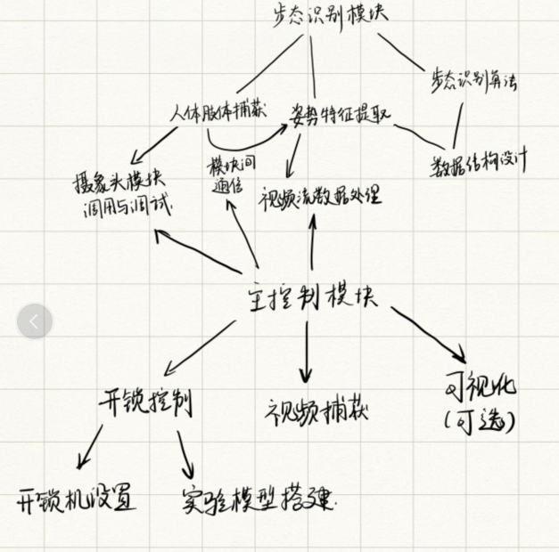
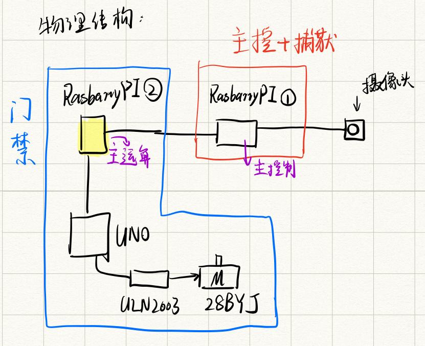

# GSR-Door
GaitSet Recognization Based Intellgent Door

### 项目架构：

### 项目物理结构：

### 主要分工：

王京首、王睿思：负责主控制模块与捕获模块开发

朱庆晨、李阳：负责步态识别模块开发、门锁机械结构设计、实验模型搭建

### 项目时间轴

1. 确定项目基本结构 √
2. 确定项目基础架构及各模块功能、确定分工
3. 撰写项目报告
4. 开发
5. 调试组装

